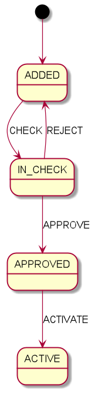

I've implemented the following employee state flow:



To build the application use:
```shell script
cd common
gradle clean build

cd ../rest-api
gradle bootBuildImage

cd ../service
gradle bootBuildImage
```
To run it with docker-compose:
```shell script
docker-compose up
```
At http://localhost:8080/swagger-ui/ you can find the application's API description. 

To watch an employee status use:
```shell script
curl "http://localhost:8080/employees/{employeeId}/status"
```
Note: IDs for employees are generated sequentially starting from 1.


**Second Part (Optional but a plus):**

Being concerned about developing high quality, resilient software, giving the fact, that you will be participating, mentoring other engineers in the coding review process.


- Suggest what will be your silver bullet, concerns while you're reviewing this part of the software that you need to make sure is being there.
  > Answer: 
  > 
  >  - Code should follow best coding practices and also be easy-readable and not over-engineered. 
  >  - Core application logic should be covered with comments and unit tests.
  >  - If the installation/deployment process is not trivial then instructions or scripts should be provided.
- What the production-readiness criteria that you consider for this solution
  > Answer: 
  >  - All kinds of testing(unit testing, integration, E2E, etc.) have to be passed.
  >  - Deployment process has to be simple, unified, and as granular as possible. It's good to define a rollback strategy for the failed deployment.
  

**Third Part (Optional but a plus):**
Another Team in the company is building another service, This service will be used to provide some statistics of the employees, this could be used to list the number of employees per country, other types of statistics which is very vague at the moment.

- Please think of a solution without any further implementation that could be able to integrate on top of your service, including the integration pattern will be used, the database storage etc.

A high-level architecture diagram is sufficient to present this.

  > Answer: 
  > 
  > I think this use case can be implemented via further Kafka utilization.
  > For example, we can create a new topic to push there all necessary employee information. 
  > The another team service then can implement a listener for this topic to receive and calculate all necessary metrics.


